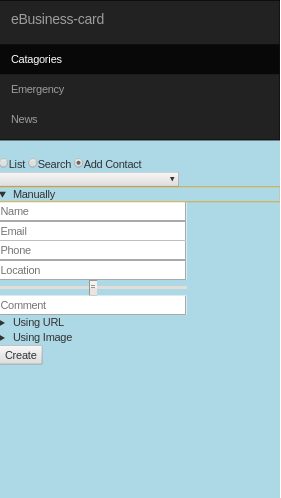

Motivation/ Objective:
* The app is built to store and organize business cards electronically rather than using hard copy.

Benefits:
1. We don't need a large pocket to put all of our contacts business cards.
2. To search and organize our contacts and choose the better ones by referring rating and special comment section.
3. We keep our environment safer by using a paperless business card and reduce pollution.
4. To provide user to have important emergency contacts.
5. To provide some hot issues and meet-ups information weekly.

Technologies used:
  * Node.js, Express.js, MongoDB, and Mongoose for the backend.
  * Express Handlebars and Angular.js for the frontend.

Dependencies required:
  1. express: to import  express module
  2. bodyParser: to import bodyParser module, to handle form submission and JSON request
  3. passport: to import and use user authentication module
  4. passport-twitter: to import and use twitter authentication module
  5. fs: to import module required to store images into the database
  5. cookie-parser: to import and use cookies from the server
  6. express-session: to import module required to store flash and cookies
  7. connect-flash: to show success and error messages

Before running the program:
1. Create new Twitter application at https://dev.twitter.com/apps
2. Create env.js file and save the following code:
    module.exports = {
      consumerKey: "your consumer Key",
      consumerSecret: "your consumer Secret",
      callbackUrl: "http://127.0.0.1:3000/auth/twitter/callback"
    }
3. Make sure to include env.js in .gitignore so your API key and secret are not pushed to GitHub!

Challenges:
1. Integrating Twitter Strategy
2. The issues related to "Convention vs configuration"
3. To store image files and URL into database

Future plan:
1. To store image files and URL into a database.
2. To use mobile camera directly to take take a picture of the business card.
3. To add features to use bar codes to store business card.

The app is deployed using Heroku and can be found: https://e-business-card.herokuapp.com 

Screen shots
* You can get the screen shots of the app under screen_shots folder.

  
